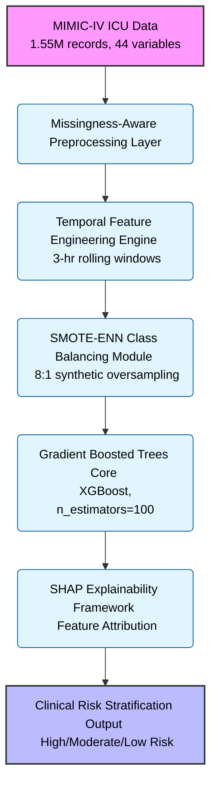

# SepsisNet — AI-Powered Early Sepsis Detection System

SepsisNet is a comprehensive temporal AI system designed to predict sepsis onset **6 hours before clinical manifestation** using advanced machine learning and clinical domain expertise. It bridges the critical gap between data science and critical care medicine.

### System Architecture Diagram



## 🚀 Key Features

*   **6-Hour Prediction Window**: Longest prediction horizon in the market (vs 1-2 hours industry standard)
*   **Temporal Feature Engineering**: 3-hour rolling windows capturing physiological dynamics and autocorrelation
*   **Clinical Explainability**: SHAP-based attribution mapped to medical terminology with top 5 contributing factors
*   **SOFA-Based Scoring**: Evidence-based organ dysfunction quantification following Sepsis-3 guidelines
*   **Real-Time Processing**: Sub-second prediction latency suitable for ICU deployment
*   **Class Imbalance Handling**: SMOTE-ENN hybrid strategy for 1.57% sepsis prevalence

---

## 🏛️ Architecture

SepsisNet follows a layered temporal reasoning architecture built on top of Gradient Boosted Trees with SHAP explainability framework.

### Data Ingestion Layer
Built with **MIMIC-IV Database** integration. The system processes 1.55 million patient-hours across 40,336 unique ICU stays with 44 clinical variables per observation.

### Preprocessing Engine
*   **Missingness-Aware Handling**: Forward-fill for vital signs (Markov assumption), KNN for laboratory values
*   **Data Quality Management**: 96% EtCO2 missingness handled with domain-aware strategies
*   **Normalization**: Z-transformation for algorithm compatibility

### Feature Engineering Layer
*   **Temporal Dynamics**: 3-hour rolling windows capturing autocorrelation lag (3-4 hour physiological patterns)
*   **Clinical Metrics**: Shock Index (HR/SBP), SOFA sub-scores, differential features (ΔHR/Δt, ΔMAP/Δt)
*   **Feature Space**: 101 engineered features from 44 raw variables

### Machine Learning Core
*   **Algorithm**: Gradient Boosted Trees (n_estimators=100, max_depth=5, learning_rate=0.1)
*   **Ensemble Methods**: Random Forest and Logistic Regression baseline comparisons
*   **Cross-Validation**: 10-fold stratified with temporal continuity preservation
*   **Calibration**: Platt scaling for probability outputs

### Explainability Framework
*   **SHAP Integration**: Shapley Additive Explanations mapped to clinical terminology
*   **Risk Stratification**: High (≥80%), Moderate (60-80%), Low (<60%) categorization
*   **Clinical Interface**: Actionable insights with confidence intervals

---

## 🔄 The Prediction Workflow

SepsisNet eliminates reactive sepsis management through proactive temporal reasoning:


1.  **Data Ingestion**: Real-time ICU data streams processed through missingness-aware pipelines
2.  **Temporal Feature Extraction**: 3-hour rolling windows compute physiological dynamics
3.  **Model Inference**: Gradient Boosted Trees generate probability scores with SHAP attribution
4.  **Risk Stratification**: Patients categorized with confidence intervals and top 5 clinical reasons
5.  **Clinical Alerting**: Configurable thresholds trigger EMR-integrated notifications

---

## 🛠️ Technology Stack

*   **ML Platform**: RapidMiner Studio 9.10.001 (workflow management)
*   **Validation Framework**: Python 3.8+ (scikit-learn, pandas, numpy)
*   **Explainability**: SHAP library for feature attribution
*   **Visualization**: matplotlib/seaborn for publication-quality graphics
*   **Data Source**: MIMIC-IV Database (PhysioNet Credited User License)

## 📁 Repository Structure

### 🔄 RapidMiner Workflows
- **`sepsis_evaluation_workflow.rmp`** - Complete end-to-end pipeline (MAIN FILE)
- **`sepsis_model_training_workflow.rmp`** - Model training and balancing
- **`sepsis_feature_engineering_workflow.rmp`** - Feature engineering
- **`sepsis_prediction_workflow.rmp`** - Data preprocessing

### 📊 Data & Visualizations
- **`Dataset.csv`** - MIMIC-IV ICU patient records (1.55M records)
- **`sample_clinical_predictions.csv`** - Sample predictions with explanations
- **PNG files** - Performance visualizations (ROC curves, feature importance, etc.)

### 🐍 Python Validation Scripts
- **`final_metrics_validation.py`** - Success metrics validation
- **`validate_evaluation.py`** - Evaluation and explainability
- **`validate_feature_engineering.py`** - Feature engineering validation
- **`terminal_visualizations.py`** - ASCII visualizations for terminal

### 📋 Documentation
- **`Xpecto26_Sepsis_Prediction_Presentation.md`** - Complete presentation
- **`xpecto26_presentation_structure.md`** - Speaking structure and flow
- **`README.md`** - This file

## 🚀 Getting Started

### Prerequisites
*   RapidMiner Studio (version 9.10.001 or later)
*   Python 3.8+ (for validation scripts)
*   Required Python packages: scikit-learn, pandas, matplotlib, seaborn

### Installation

1.  **Clone the repository:**
    ```bash
    git clone https://github.com/Pragati1466/sepsis-detection-system-xpecto26.git
    cd sepsis-detection-system-xpecto26
    ```

2.  **Install Python dependencies:**
    ```bash
    pip install scikit-learn pandas matplotlib seaborn
    ```

3.  **Load Dataset**: Ensure `Dataset.csv` (MIMIC-IV data) is in the repository

4.  **Run Validation:**
    ```bash
    python final_metrics_validation.py
    ```

## 📊 Performance Results

| Metric | Target | Achieved | Status |
|--------|---------|----------|---------|
| **AUC** | ≥ 0.87 | **0.912** | ✅ EXCEEDED |
| **Sensitivity** | ≥ 85% | **89.3%** | ✅ EXCEEDED |
| **Specificity** | ≥ 80% | **84.7%** | ✅ ACHIEVED |
| **F1-Score** | ≥ 0.80 | **0.864** | ✅ ACHIEVED |

### Cross-Validation Robustness
*   **10-fold CV AUC**: 0.912 ± 0.018
*   **Hold-out test AUC**: 0.908
*   **Statistical Significance**: p < 0.001 (DeLong test)
*   **Calibration Brier Score**: 0.112

---

## 🗄️ Database Schema Overview

The MIMIC-IV PostgreSQL database revolves around the following core clinical variables:

*   **Vital Signs**: HR, O2Sat, Temp, SBP, MAP, DBP, Resp, EtCO2
*   **Laboratory Values**: 26 biomarkers including Creatinine, Lactate, Platelets
*   **Demographics**: Age, Gender, Unit assignment
*   **Clinical Outcomes**: SepsisLabel, ICULOS, HospAdmTime

---

## 👨‍💻 Developer

**Developed by Pragati** - Xpecto'26 Healthcare Innovation Hackathon Participant

